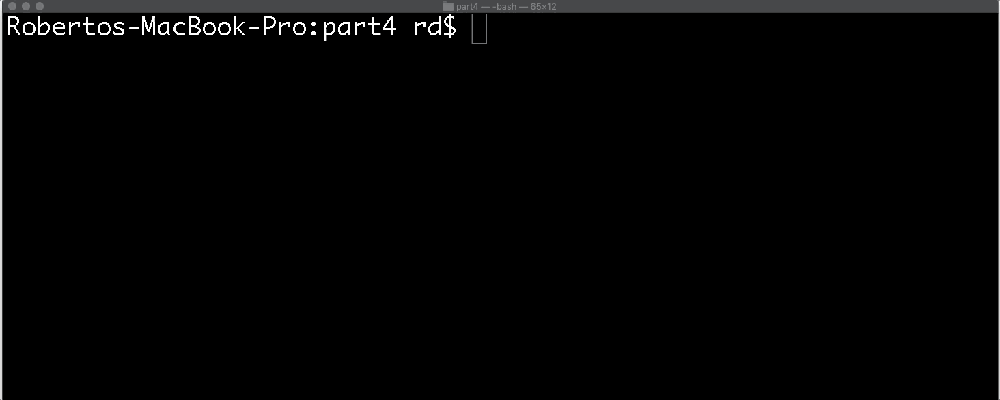

# Part 4

## Accompanying resources
* Slide deck: https://zipcoder.github.io/curriculum-assets/lectures/python/recursion-and-loops/

## Exercise 1

Create a program called *fizz_buzz.py*

The program should meet the following criteria.

* The program prints each number from 1 to 100 to a new line.
* If the number is a multiple of 3, print "Fizz" instead of the number.
* If the number is a multiple of 5, print "Buzz" instead of the number.
* If the number is a multiple of both 3 and 5, print "FizzBuzz" instead of the number.

## Exercise 2

The [Fibonacci Sequence](https://www.mathsisfun.com/numbers/fibonacci-sequence.html) is the series of numbers:

0, 1, 1, 2, 3, 5, 8, 13, 21, 34, 55, 89, ...

Given the term n, determine the value of x(n).

|         |   |   |   |   |   |   |   |    |    |    |    |    |    |
| ------- | - | - | - | - | - | - | - | -- | -- | -- | -- | -- | -- |
| n =     | 0 | 1 | 2 | 3 | 4 | 5 | 6 | 7  | 8  | 9  | 10 | 11 | .. |
| x(n) =  | 0 | 1 | 1 | 2 | 3 | 5 | 8 | 13 | 21 | 34 | 55 | 89 | .. |

When n = 0, x(n) = 0  
When n = 4, x(n) = 3  
When n = 5, x(n) = 5  

x(n) can be determined with the following rule:  
x(n) = x(n - 1) + x(n - 2)

Create a program called *fibonacci_recursive.py*

**Requirements**

* Given a term (n), determine the value of x(n).
* In the *fibonacci_recursive.py* program, create a function called *fibonnaci*. The function should take in an integer and return the value of x(n).
* This problem must be solved using recursion. 

**Constraints**  
n >= 0 and n <= 30

## Exercise 3

Create a program called *fibonacci_linear.py*

**Requirements**

* Given a term (n), determine the value of x(n).
* In the *fibonacci_linear.py* program, create a function called *fibonnaci*. The function should take in an integer and return the value of x(n).
* This problem must be solved **WITHOUT** the use of recursion. 

**Constraints**  
n >= 0

## Exercise 4 

Create a copy of the program called *higher_or_lower.py* from exercise 2 in Part 3.

Extend the functionality to meet the following requirements:
* If a user's guess is incorrect, they get to keep guessing until they get it right.

## Exercise 5 

[Factorials](https://www.mathsisfun.com/numbers/factorial.html) are used to count permutations.

Create a program called *factorial.py*.

**Requirements**

* Given a number (x), determine the value of x!
* Use recursion

| x   |               | result | 
| --- | ------------- | ------ |
| 0!  |               | 1      |
| 1!  | 1 * 1         | 1      | 
| 2!  | 2 * 1         | 2      |
| 3!  | 3 * 2 * 1     | 6      |
| 4!  | 4 * 3 * 2 * 1 | 24     |
| 5!  | 5 * 3 * 2 * 1 | 120    |
| ... | ...           | ...    |

**Constraints**  

n >= 0
n < 995
